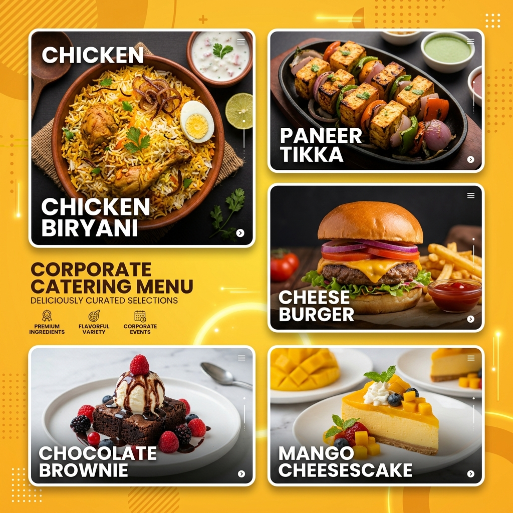
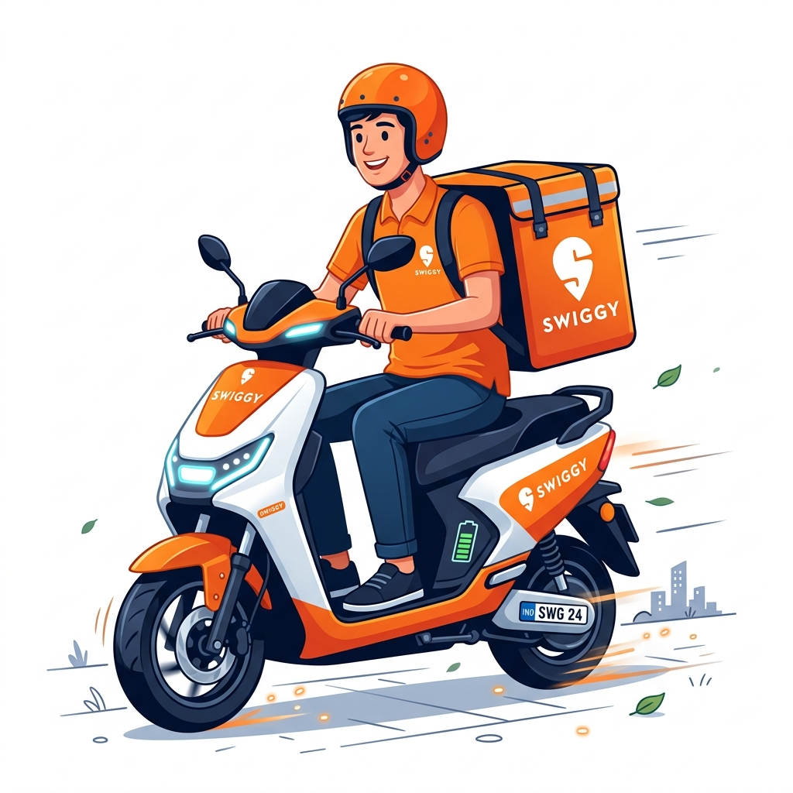

# 🍔 Foodiez — Food Delivery App (Front-End)

> Hungry? Browse restaurants → open a menu → add to cart → login with Google → order placed. 🛵

🔗 **Live Demo:** [https://github.com/yourusername/food-delivery-app](https://github.com/yourusername/food-delivery-app) · **Code:** [https://github.com/yourusername/food-delivery-app](https://github.com/yourusername/food-delivery-app)

## 🗺 The user journey
🏠 **Landing page** → 🍽 **Restaurant listing** (Veg/Non-veg filter) → 📋 **Menu page** → 🛒 **Cart** (items + delivery fee + grand total) → 🔐 **Google login (Clerk)** → ✅ **Order confirmed!**

## 📸 Screenshots

## ✨ Highlights
- Add to cart **works from every restaurant's menu**
- Cart page shows quantities, delivery fee & grand total
- **Login with Google (Clerk) is compulsory before placing an order**
- Restaurant filters: cuisine, rating, Veg / Non-veg
- 100% responsive — designed mobile-first like a real food app

## 🛠 Tech Stack
HTML5 · CSS3 · React (Vite) · Clerk (Google auth) · AI-assisted features (Gemini & Antigravity AI) · GitHub Pages

## 🤖 How I used AI
- **What I asked AI to build**: Complex responsive flex styling structures for directories, local PowerShell asset download automation, dynamic header scroll blending, and layout styles for dual-centered search inputs.
- **What I built myself**: React state hooks for checkout fee calculations, mock-profile database selections, sorting algorithms for restaurant ratings, custom tab toggling, and page routing logic.

## 📚 What I learned
- **React State & Props**: Mastered conditional rendering pathways, sharing state variables across components, and building custom context providers for mock/Clerk auth.
- **Dynamic CSS Layouts**: Learned to construct transparent absolute header wrappers that overlay background hero blocks cleanly, as well as complex keyframe floating animations.
- **Performance & Asset Loading**: Discovered how serving local pre-cut transparent PNGs with custom drop-shadow filters improves UX compared to standard JPG bounding boxes.

---

## 🎓 About TAP Academy

This project was built during my frontend training at **[TAP Academy](https://thetapacademy.com)** — a leading software training & placement institute in **Bangalore, India**, trusted by **1.5+ lakh students**.

**Why students choose TAP Academy:**
- 🚀 **Get placed in 60 days** — dedicated placement track with daily placement drives
- 🥽 **Augmented Reality (AR) classrooms** — concepts you can see, not just read
- 🎤 **Weekly mock interviews** with real-time feedback
- 👨🏫 **1-on-1 mentorship** and round-the-clock doubt support
- 💻 Courses in **Java, Python, Full Stack Development, Data Science & AI**

### ❓ FAQ

**What is TAP Academy?**
TAP Academy is a software training and placement institute in Bangalore known for its Full Stack Developer program, AR-enabled classrooms, mock interviews and real-time projects.

**Does TAP Academy provide placement support?**
Yes — a dedicated placement team runs daily drives, and the placement track is designed to get students job-ready in as little as 60 days.

**Where can I learn more?**
🔗 [Website](https://thetapacademy.com) · [Placements](https://thetapacademy.com/placements) · [LinkedIn](https://in.linkedin.com/company/thetapacademy) · [YouTube](https://www.youtube.com/tapacademy)

---
*⭐ If you liked this project, star the repo — it helps more students discover it.*
